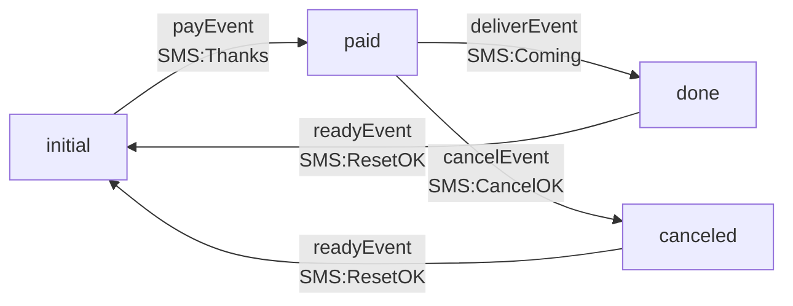
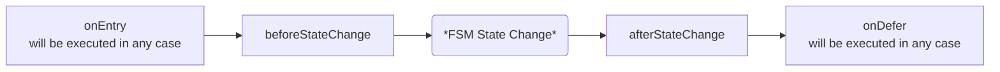
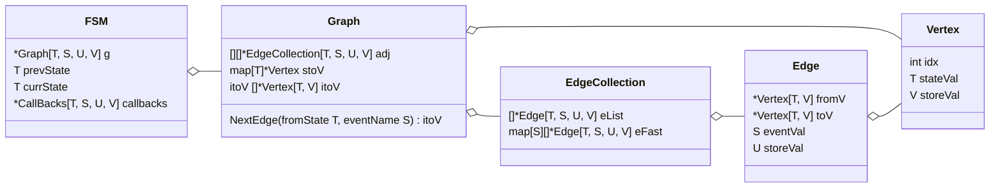

# Go-Generic-FSM

_**A Generic Finite State Machine Implemented In Go Language**_

## Install

Go 1.18 or higher is required for generic.

```
go get github.com/kiexu/go-generic-fsm 
```

## Usage

1. Define FSM with config: `gfsm.DefConfig` based on state migration;
2. Use `gfsm.NewFsm(config, initStatus)` to New a `gfsm.FSM`;
3. Call `gfsm.FSM.Trigger()` to trigger event and run callback functions automatically.

## Demo
Let's use an FSM that simulates the online shopping process as a demo.

We want to send an SMS to the user once the status is changed. The SMS content is shown in the `Graph`'s `Edges`, and it is considered as an attribute of an `Event`.



### Define Configuration

#### Type Definition

Start with `gfsm.DefConfig`, which is the only config struct now:

```go
// DefConfig Default factory with basic config struct
// As a regular FSM, {stateVal, eventVal} need to be unique
type DefConfig[T, S comparable, U, V any] struct {
    DescList     []*DescCell[T, S, U, V] // Required. Describe FSM graph
    StatusValMap map[T]V                 // Optional. Store custom value in abstract status
}
```

You can also develop your own config struct by implementing the `gfsm.Config` interface.

First, we need to decide the concrete type of the generic `[T, S, U, V]`:

|       | Desc                   | Generic type     | Required or not | Type in this demo           |
|-------|------------------------|------------------|-----------------|-----------------------------|
| **T** | State type             | comparable       | `required`      | `string`(E.g "initial")     |
| **S** | Event type             | comparable       | `required`      | `string`(E.g "payEvent")    |
| **U** | Object stored in Event | any(interface{}) | `optional`      | `string`(SMS content)       |
| **V** | Object stored in State | any(interface{}) | `optional`      | `gfsm.NA`(type placeholder) |

You can use `gfsm.NA` to temporarily fill unused type just as the `context.TODO`.

```go
// NA placeholder of unused type
type NA struct{}
```

#### Define DefConfig

In this demo we ignore `DefConfig.StatusValMap` because the custom attributes of the `State` are not used (filled by `fsm.NA`).

Just remember if `U` or `V` is set, they can be easily get both in the callback function and in the event trigger function result.

Here is our config:

```go
var demoFac = &gfsm.DefConfig[string, string, string, gfsm.NA]{
	DescList: []*gfsm.DescCell[string, string, string, gfsm.NA]{
		{
			EventVal:      "payEvent",
			FromState:     []string{"initial"}, 
			ToState:       "paid",              
			EventStoreVal: "Thanks",            // SMS message
		},
		{
			EventVal:      "deliverEvent",
			FromState:     []string{"paid"},
			ToState:       "done",
			EventStoreVal: "Coming",
		},
		{
			EventVal:      "readyEvent",
			FromState:     []string{"done", "canceled"}, // Multiple fromState leads to one toState supported
			ToState:       "initial",
			EventStoreVal: "ResetOK",
		},
		{
			EventVal:      "cancelEvent",
			FromState:     []string{"paid"},
			ToState:       "canceled",
			EventStoreVal: "CancelOK",
		},
	},
}
```

#### Initialize FSM

We initialize with the above config `demoFac` and initial state `"initial"`:

```go
demoFsm, err := gfsm.NewFsm[string, string, string, gfsm.NA](demoFac, "initial")
```

We successfully get the generic `FSM` **demoFsm** now.

#### Trigger FSM

Use `Trigger()` method to trigger event and check the returning `Event` to check results.

```go
event, err := demoFsm.Trigger("payEvent")

// Event packaging an eventE
type Event[T, S comparable, U, V any] struct {
    fSM      *FSM[T, S, U, V]  // Pointer to fSM
    eventVal S                 // raw input event value
    args     []interface{}     // Args to pass to callbacks
    eventE   *Edge[T, S, U, V] // Event value. eg. string or integer
}

// FromState get old State of FSM
func (e *Event[T, S, U, V]) FromState() (resp T)

// ToState get new State of FSM
func (e *Event[T, S, U, V]) ToState() (resp T)
```

## Callbacks

### Ordinary Callbacks Usage

You can use:

```go
func (f *FSM[T, S, U, V]) SetCallbacks(callbacks *CallBacks[T, S, U, V])
```

to set up callback functions that will be executed in the `Trigger()` method.

```go
// CallBacks do something while eventE is triggering
type CallBacks[T, S comparable, U, V any] struct {
    onEntry           func(*Event[T, S, U, V]) error    // will be executed in any case
    beforeStateChange func(*Event[T, S, U, V]) error
    afterStateChange  func(*Event[T, S, U, V]) error
    onDefer           func(*Event[T, S, U, V], error)   // will be executed in any case
}
```



`onEntry` an `onDefer` will be executed in any case and can be used for some work such as resource allocate/release, data statistics, etc.

Variables can also be passed implicitly to these callback functions if desired.

### Advanced Callbacks Usage

The callback function can access the **custom attributes** of **any** `Event` and `State` when it is executed. It means that you can define custom attributes as functions to execute, you can integrate your callback function design in the config, and avoid the config scattered in two places.

```go
testFSM.SetCallbacks(&CallBacks[nodeState, eventVal, edgeVal, nodeVal]{
    afterStateChange: func(e *Event[nodeState, eventVal, edgeVal, nodeVal]) error {
        return e.EventE().storeVal(e, w, t) // call a custom function in event store value
    },
})
```


## Terminology

This `Finite State Machine` module is based on the data structure: Graph, which maps the `state` and `event` of the
state machine to the `vertex` and `edge` of the Graph.

### FSM & Graph

In this library, the difference between `Graph` and `FSM` is: `FSM` are **stateful**,`Graph` is **stateless**, `Graph` can be considered as a **Config** of `FSM`.



### Event | Edge

```go
// Edge Event value included
type Edge[T, S comparable, U, V any] struct {
    fromV    *Vertex[T, V] // From vertex
    toV      *Vertex[T, V] // To vertex
    eventVal S             // Event value. Not unique
    storeVal U             // Anything you want. e.g. Real callback function(use CallBacks to invoke)
}
```


| FSM                     | Graph            | Type            | Description                                                                                                |
|-------------------------|------------------|-----------------|------------------------------------------------------------------------------------------------------------|
| Event(abstract)         | Edge             | /               | An abstract container that stores from and to Vertex and other values                                      |
| Event's from & to state | Edge.fromV & toV | `*Vertex[T, V]` | The from and to abstract state is stored, and the state attributes can be obtained from here               |
| Event's value           | Edge.eventVal    | `S comparable`  | FSM's event value to express business meaning. E.g "take an order"                                         |
| Event's other attribute | Edge.storeVal    | `U any`         | Define your own data structure to store any other event attribute or callback functions of Event dimension |

### State | Vertex

```go
// Vertex idx start with number 0
type Vertex[T comparable, V any] struct {
	idx      int // Vertex idx. Auto generated based on unique stateVal
	stateVal T   // State value. Need to be unique
	storeVal V   // Anything you want
}
```

| FSM                     | Graph           | Type           | Description                                                                                                |
|-------------------------|-----------------|----------------|------------------------------------------------------------------------------------------------------------|
| State(abstract)         | Vertex          | /              | An abstract container that encapsulates all state properties                                               |
| /                       | Vertex.idx      | `int`          | Automatically generated according to config, used for graph, meaningless to FSM                            |
| State's value           | Vertex.stateVal | `T comparable` | FSM's unique state value to express business meaning. E.g "paid" or "2"                                    |
| State's other attribute | Vertex.storeVal | `V any  `      | Define your own data structure to store any other state attribute or callback functions of State dimension |


## Contributing

[Kiexu](https://github.com/kiexu)

## License

MIT