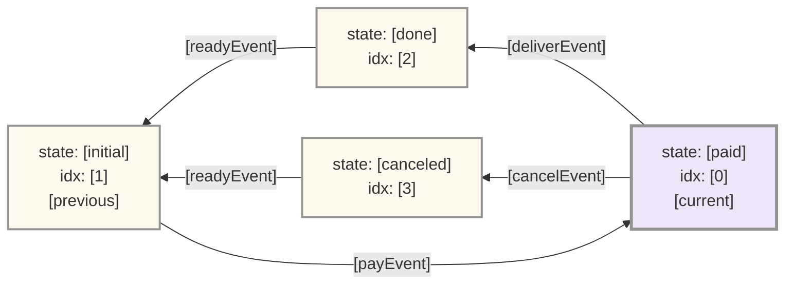
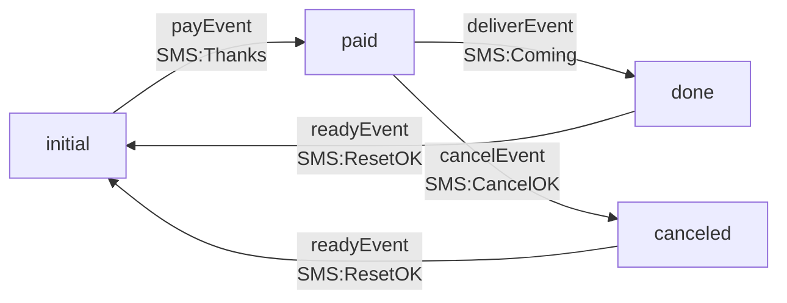
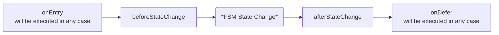
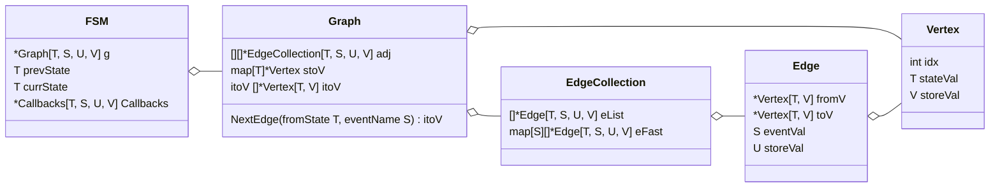

# Go-Generic-FSM

_**基于Go语言泛型实现的有限状态机**_

## 安装

为支持Go泛型，需要Go 1.18或更高版本.

```
go get github.com/kiexu/go-generic-fsm 
```

## 安装插件 (可选)

### 可视化插件 go-generic-fsm-visual-pack

[可视化插件 go-generic-fsm-visual-pack](https://github.com/kiexu/go-generic-fsm-visual-pack) 可以在用户指定的端口上启动一个HTTP服务，提供包括当前状态标记的状态图。

```
go get github.com/kiexu/go-generic-fsm-visual-pack
```

```go
_ = fsmv.InitFSMVisualPack(&fsmv.Config{
    Port:         9527, // 用户自选端口
    NativeScript: true, // 网络需要改善的用户可选择使用本地JavaScript文件
})

// 使用 Visualize() 开启状态机可视化
w := &fsm.VisualOpenWrapper{} 
err = demoFsm.OpenVisualization(w) // 调用后可以从变量w中获取网页路径
```

调用 OpenVisualization() 后, 访问: `localhost:9527(port in config)` + w.Path, 
来查看可视化的状态机节点、节点名称、节点下标等信息:

例如：http://localhost:9527/fsm/visualize/8f101b6e-ed2d-420a-b0d8-e7684e130a5a



如果不需要状态机对象了，**不要忘记** 调用 CloseVisualization() 释放资源，否则状态机对象由于持续被`可视化插件`引用，将不会被GC。

```go
err = demoFsm.CloseVisualization(&fsm.VisualCloseWrapper{Token: w.Token})
```

## 基础使用方法

1. 基于业务的状态迁移需求，编写配置: `fsm.DefConfig`;
2. 调用 `fsm.NewFsm(config, initStatus)` 新建状态机对象： `fsm.FSM`;
3. 调用 `fsm.FSM.Trigger()` 触发事件，并自动触发回调函数。

## 使用流程
我们使用状态机模拟一个网购流程，作为使用示例。
假设需求中，每当状态变化时，我们还需要给用户发送短信。短信内容是`事件Event`的一部分，被储存在`状态图Graph`的`边Edge`中



### 定义状态机配置

#### 类型定义

示例中我们使用 `fsm.DefConfig`, 目前这个状态机模块唯一的配置结构进行配置：

```go
// 基础配置
// 参数校验中 {状态 + 事件} 的搭配需唯一
type DefConfig[T, S comparable, U, V any] struct {
    DescList     []*DescCell[T, S, U, V] // 必需. 描述了状态图
    StatusValMap map[T]V                 // 可选. 支持在状态节点内存储自定义信息
}
```

通过自行实现 `fsm.Config` 接口，用户也可以自定义自己的状态机配置结构。

首先我们根据需求，决定4个泛型类型 `[T, S, U, V]`:

|       | 描述          | 泛型要求             | 是否可选 | 本示例中选定的类型               |
|-------|-------------|------------------|------|-------------------------|
| **T** | 状态节点类型      | comparable       | `必需` | `string`(例如 "initial")  |
| **S** | 事件类型        | comparable       | `必需` | `string`(例如 "payEvent") |
| **U** | 事件中存储的自定义类型 | any(interface{}) | `可选` | `string`(短信发送内容)        |
| **V** | 节点中存储的自定义类型 | any(interface{}) | `可选` | `fsm.NA`(未使用类型的占位符)     |

可以暂时将未使用的类型定义为`fsm.NA`，就像 `context.TODO`一样。

```go
// NA 未使用类型的占位符
type NA struct{}
```

#### 定义 DefConfig

在这个示例里，我们忽略 `DefConfig.StatusValMap` 因为`State`中的自定义属性没有被用到 (我们用`fsm.NA`占位了).

如果 `U` or `V` 被赋值, 这两个自定义对象可以方便地被 **回调函数Callback** 和 **状态触发Trigger()的返回值** 获取到。

最终配置结构如下:

```go
var demoFac = &fsm.DefConfig[string, string, string, fsm.NA]{
	DescList: []*fsm.DescCell[string, string, string, fsm.NA]{
		{
			EventVal:      "payEvent",
			FromState:     []string{"initial"}, 
			ToState:       "paid",              
			EventStoreVal: "Thanks",            // 短信内容
		},
		{
			EventVal:      "deliverEvent",
			FromState:     []string{"paid"},
			ToState:       "done",
			EventStoreVal: "Coming",
		},
		{
			EventVal:      "readyEvent",
			FromState:     []string{"done", "canceled"}, // 多个 fromState 可以通过事件迁移到一个 toState 
			ToState:       "initial",
			EventStoreVal: "ResetOK",
		},
		{
			EventVal:      "cancelEvent",
			FromState:     []string{"paid"},
			ToState:       "canceled",
			EventStoreVal: "CancelOK",
		},
	},
}
```

#### 初始化状态机

我们用上面的配置 `demoFac` 初始化状态机，初始状态为 `"initial"`:

```go
demoFsm, err := fsm.NewFsm[string, string, string, fsm.NA](demoFac, "initial")
```

现在终于获得了状态机 **demoFsm**。

#### 触发状态迁移

使用 `Trigger()` 触发事件, 然后检查 `Event` 获得执行结果。

```go
event, err := demoFsm.Trigger("payEvent")

// Event
type Event[T, S comparable, U, V any] struct {
    fSM      *FSM[T, S, U, V]  // Event所归属状态机的指针
    eventVal S                 // 输入事件
    args     []interface{}     // 可选参数，可在回调函数内获取
    eventE   *Edge[T, S, U, V] // 包装了一条边供访问
}

// FromState 获取状态机的上一个状态
func (e *Event[T, S, U, V]) FromState() (resp T)

// ToState 获取状态机的当前状态
func (e *Event[T, S, U, V]) ToState() (resp T)
```

在单个状态机并发使用的环境中, `Event` 中的两个方法返回的 `State` 是不变的，会忠实反应该次事件触发的结果。
不推荐使用`FSM` 中的 `State` ，因为很可能返回并发的执行结果。

#### 其他配套方法

状态机还有一些实用方法如：

```go
// CanTrigger 是否给定事件可以在当前状态下被触发
func (f *FSM[T, S, U, V]) CanTrigger(eventVal S) bool

// PeekState 查看给定条件下会迁移至的状态，但不执行
func (f *FSM[T, S, U, V]) PeekState(state T, eventVal S) (T, bool)

// CanMigrate 判断当前状态是否可以(在一步或多步后)迁移至给定状态，即连通性
func (f *FSM[T, S, U, V]) CanMigrate(toState T) bool

```

## 回调函数

### 常规使用

可以用；

```go
func (f *FSM[T, S, U, V]) SetCallbacks(Callbacks *Callbacks[T, S, U, V])
```

来定义 `Trigger()` 中会被自动执行的回调函数.

```go
// Callbacks 事件触发时被调用
type Callbacks[T, S comparable, U, V any] struct {
    onEntry           func(*Event[T, S, U, V]) error    // 无论任何异常都会被调用
    beforeStateChange func(*Event[T, S, U, V]) error
    afterStateChange  func(*Event[T, S, U, V]) error
    onDefer           func(*Event[T, S, U, V], error)   // 无论任何异常都会被调用
}
```



`onEntry` 和 `onDefer` 任何情况下都会被调用，适合诸如资源申请与释放、数据统计等性质的工作。

一个常见的做法是回调函数中可以利用函数定义时的作用域隐式传递指针，来提供入参或者获取返回值。

### 进阶回调函数使用

回调函数执行时，可以访问**所有** `Event` 和 `State`的**自定义属性**。意味着自定义属性本身可以包含回调函数，这样做可以将回调函数的配置整合进一个状态机配置。
```go
testFSM.SetCallbacks(&Callbacks[nodeState, eventVal, edgeVal, nodeVal]{
    afterStateChange: func(e *Event[nodeState, eventVal, edgeVal, nodeVal]) error {
        return e.EventE().storeVal(e, w, t) // 调用了事件中储存的自定义函数
    },
})
```

## 原理与术语

`状态机Finite State Machine` 是基于 `图Graph`的. `状态机FSM` 和 `图Graph` 的映射关系基于: `状态机FSM` 的 `状态State` 对应 `图Graph` 的 `节点Vertex`, `状态机FSM` 的 `事件Event` 对应 `图Graph` 的 `边Edge`。

### 状态机与图

`图Graph` 和 `状态机FSM` 在本模块中的区别是: `状态机FSM` 是 **有状态的**,`图Graph` 是 **无状态的**, `图Graph` 可以被视为 `状态机FSM` 的**配置**。



### 事件与边

```go
// Edge 边
type Edge[T, S comparable, U, V any] struct {
    fromV    *Vertex[T, V] // 迁移之前的节点
    toV      *Vertex[T, V] // 迁移后的节点
    eventVal S             // 事件值，无需唯一
    storeVal U             // 想储存的任意值。例如回调函数(用Callbacks配置来调用)
}
```


| 状态机FSM  | 图Graph           | 类型              | 描述                                |
|---------|------------------|-----------------|-----------------------------------|
| 抽象的事件概念 | Edge             | /               | 储存事件信息与起止节点的抽象容器                  |
| 事件的起止节点 | Edge.fromV & toV | `*Vertex[T, V]` | 储存抽象的起止节点信息，可以从中访问节点(状态)属性        |
| 事件值     | Edge.eventVal    | `S comparable`  | 具备业务含义的状态机事件值. 例如 "take an order" |
| 事件自定义属性 | Edge.storeVal    | `U any`         | 可以任意储存事件维度的属性和/或回调函数              |

### 状态与节点

```go
// Vertex 角标从0开始
type Vertex[T comparable, V any] struct {
	idx      int // 自动生成的对应唯一stateVal的角标
	stateVal T   // 状态值，需要唯一
	storeVal V   // 任意的储存结构
}
```

| 状态机FSM  | 图Graph          | 类型             | 描述                            |
|---------|-----------------|----------------|-------------------------------|
| 抽象的状态概念 | Vertex          | /              | 一个存储了所有状态属性的抽象容器              |
| /       | Vertex.idx      | `int`          | 根据配置自动生成，在状态机维度无意义            |
| 状态值     | Vertex.stateVal | `T comparable` | 具备业务含义的状态机节点值，例如 "paid" 或 "2" |
| 状态其他属性  | Vertex.storeVal | `V any  `      | 可以任意储存状态维度的属性和/或回调函数          |

## 依赖

* [go-generic-collection](https://github.com/kiexu/go-generic-collection) - Java风格的Go容器库
* [gin](https://github.com/gin-gonic/gin) - 可视化使用的Web框架
* [mermaid](https://github.com/mermaid-js/mermaid) - JS实现的可视化库
* [uuid](https://github.com/google/uuid) - 生成UUID

## 贡献者

[Kie Xu](https://github.com/kiexu)

## 开源协议
MIT